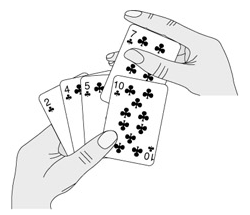

.. _排序与查找:

排序与查找
##########

算法的概念
==========

算法（ Algorithm） 是将一组输入转化成一组输出的一系列计算步骤， 其中每个步骤必须能在有限时间内完成。 比如 :ref:`递归` 习题 1 中的 Euclid 算法，输入是两个正整数， 输出是它们的最大公约数， 计算步骤是取模、 比较等操作， 这个算法一定能在有限的步骤和时间内完成（ 想一想为什么？）。 再比如将一组数从小到大排序， 输入是一组原始数据， 输出是排序之后的数据， 计算步骤包括比较、 移动数据等操作。

算法是用来解决一类计算问题的，注意是一类问题，而不是一个特定的问题。例如，一个排序算法应该能对任意一组数据进行排序，而不是仅对 ``int a[] = { 1, 3, 4, 2, 6, 5 };`` 这样一组数据排序，如果只需要对这一组数据排序可以写这样一个函数来做：

.. code-block:: c

    void sort(void)
    {
        a[0] = 1;
        a[1] = 2;
        a[2] = 3;
        a[3] = 4;
        a[4] = 5;
        a[5] = 6;
    }

这显然不叫算法，因为不具有通用性。由于算法是用来解决一类问题的，它必须能够正确地解决这一类问题中的任何一个实例，这个算法才是正确的。对于排序算法，任意输入一组数据，它必须都能输出正确的排序结果，这个排序算法才是正确的。不正确的算法有两种可能，一是对于该问题的某些输入，该算法会无限计算下去，不会终止，二是对于该问题的某些输入，该算法终止时输出的是错误的结果。有时候不正确的算法也是有用的，如果对于某个问题寻求正确的算法很困难，而某个不正确的算法可以在有限时间内终止，并且能把误差控制在一定范围内，那么这样的算法也是有实际意义的。例如有时候寻找最优解的开销很大，往往会选择能给出次优解的算法。

本章介绍几种典型的排序和查找算法，并围绕这几种算法做时间复杂度分析。学完本章之后如果想进一步学习，可以参考一些全面系统地介绍算法的书，例如 :ref:`[TAOCP]` 和 :ref:`[算法导论]` 。

插入排序
========

插入排序算法类似于玩扑克时抓牌的过程，玩家每拿到一张牌都要插入到手中已有的牌里，使之从小到大排好序。例如（该图出自 :ref:`[算法导论]` ）：

也许你没有意识到， 但其实你的思考过程是这样的： 现在抓到一张 7， 把它和手里的牌从右到左依次比较， 7 比 10 小， 应该再往左插， 7 比 5 大， 好， 就插这里。 为什么比较了 10 和 5 就可以确定 7 的位置？ 为什么不用再比较左边的 4 和 2 呢？ 因为这里有一个重要的前提： 手里的牌已经是排好序的。 现在我插了 7 之后， 手里的牌仍然是排好序的， 下次再抓到的牌还可以用这个方法插入。

编程对一个数组进行插入排序也是同样道理，但和插入扑克牌有一点不同，不可能在两个相邻的存储单元之间再插入一个单元，因此要将插入点之后的数据依次往后移动一个单元。排序算法如下：

.. literalinclude:: _code/insertion.sort.c
    :language: c
    :name: 插入排序
    :linenos:

为了更清楚地观察排序过程，我们在每次循环开头插了打印语句，在排序结束后也插了打印语句。程序运行结果是::

     0:  96,  93,   0,   0,   2,  73,  21,  73,  30,  46,
     1:  96,  93,   0,   0,   2,  73,  21,  73,  30,  46,
     2:  93,  96,   0,   0,   2,  73,  21,  73,  30,  46,
     3:   0,  93,  96,   0,   2,  73,  21,  73,  30,  46,
     4:   0,   0,  93,  96,   2,  73,  21,  73,  30,  46,
     5:   0,   0,   2,  93,  96,  73,  21,  73,  30,  46,
     6:   0,   0,   2,  73,  93,  96,  21,  73,  30,  46,
     7:   0,   0,   2,  21,  73,  93,  96,  73,  30,  46,
     8:   0,   0,   2,  21,  73,  73,  93,  96,  30,  46,
     9:   0,   0,   2,  21,  30,  73,  73,  93,  96,  46,
    -1:   0,   0,   2,  21,  30,  46,  73,  73,  93,  96,

这个来自 Wikipedia 的 GIF 图也许能给你带来直观的印象:

.. image:: https://upload.wikimedia.org/wikipedia/commons/0/0f/Insertion-sort-example-300px.gif
    :align: center

如何严格证明这个算法是正确的？ 换句话说， 只要反复执行该算法的外层 for 循环体， 执行 ``length-1`` 次， 就一定能把数组 ``array`` 排好序， 而不管数组 ``array`` 的原始数据是什么， 如何证明这一点呢？ 我们可以借助 *循环不变性* 的概念和数学归纳法来理解循环结构的算法， 假如某个判断条件满足以下三条准则， 它就称为 *循环不变性*：

1. 第一次执行循环体之前该判断条件为真。
#. 如果 "第 N-1 次循环之后（ 或者说第 N 次循环之前） 该判断条件为真" 这个前提可以成立， 那么就有办法证明第 N 次循环之后该判断条件仍为真。
#. 如果在所有循环结束后该判断条件为真，那么就有办法证明该算法正确地解决了问题。

只要我们找到这个 循环不变性 ，就可以证明一个循环结构的算法是正确的。上述插入排序算法的 循环不变性 是这样的判断条件：第 ``j`` 次循环之前，子序列 ``array[0 .. j-1]`` 是排好序的。在上面的打印结果中， 我在最前面标注了子序列是前多少位 。下面我们验证一下 循环不变性 的三条准则：

1. 第一次执行循环之前， ``j=1`` ，子序列 ``a[0..j-1]`` 只有一个元素 ``a[0]`` ，只有一个元素的序列显然是排好序的。
#. 第 ``j`` 次循环之前，如果 “子序列 ``a[0..j-1]`` 是排好序的” 这个前提成立，现在要把 ``key=a[j]`` 插进去，按照该算法的步骤，把 ``a[j-1]`` 、 ``a[j-2]`` 、 ``a[j-3]`` 等等比 key大的元素都依次往后移一个，直到找到合适的位置给 ``key`` 插入，就能证明循环结束时子序列 ``a[0..j]`` 是排好序的。就像插扑克牌一样，“手中已有的牌是排好序的”这个前提很重要，如果没有这个前提，就不能证明再插一张牌之后也是排好序的。
#. 当循环结束时， ``j=length`` ，如果“子序列 ``a[0..j-1]`` 是排好序的”这个前提成立，那就是说 ``a[0..length-1]`` 是排好序的，也就是说整个数组 ``array`` 的 ``length`` 个元素都排好序了。

可见，有了这三条，就可以用数学归纳法证明这个循环是正确的。这和 :ref:`递归` 证明递归程序正确性的思想是一致的，这里的第一条就相当于递归的 Base Case，第二条就相当于递归的递推关系。这再次说明了递归和循环是等价的。

算法的时间复杂度分析
====================

解决同一个问题可以有很多种算法，比较评价算法的好坏，一个重要的标准就是算法的时间复杂度。现在研究一下插入排序算法的执行时间，按照习惯，输入长度 ``length`` 以下用 ``n`` 表示。设循环中各条语句的执行时间分别是 :math:`c_1, c_2, c_3` 这样三个常数 [#F23]_ ：

.. code-block:: c

    void insertion_sort(int* array, size_t length)   // 执行时间
    {
        int key;
        int i;

        for (int j = 1; j < length; j++) {
            key = array[j];                     // c_1
            for (i = j - 1; i >= 0; i--) {
                if (array[i] > key) {           // c_2, 表示整个 if 结构
                    array[i + 1] = array[i];
                } else {
                    break;
                }
            }
            array[i + 1] = key;                 // c_3
        }

显然外层 for 循环的执行次数是 :math:`n-1` 次，假设内层的 for 循环执行 :math:`m` 次，则总的执行时间粗略估计是 :math:`(n-1) (c_1 + c_3 + m c_2)` 。当然， for 循环 后面括号中的赋值和条件判断的执行也需要时间，而我没有设一个常数来表示，这不影响我们的粗略估计。

这里有一个问题， :math:`m` 不是个常数，也不取决于输入长度 :math:`n` ，而是取决于具体的输入数据。在最好情况下，数组 ``a`` 的原始数据已经排好序了，内层 for 循环一次也不执行，总的执行时间是 :math:`(n-1)*(c_1 + c_3)` ，可以表示成 :math:`an+b` 的形式，是 :math:`n` 的线性函数（Linear Function） 。那么在最坏情况（Worst Case） 下又如何呢？所谓最坏情况是指数组 ``a`` 的原始数据正好是从大到小排好序的，这意味着需要从头到尾重新排序，把上式中的 :math:`m` 替换掉算一下执行时间就是:

.. math::
    m = \sum_{i=1}^{n-1} i = \frac{n}{2}

则总时间为

.. math::
    T = (n-1)(c_1 + c_3 + \frac{c_2 n}{2})
      = \frac{c_2}{2} n^2 + \frac{2c_1 + 2c_3 - c_2}{2} - (c_1 + c_3)

数组a的原始数据属于最好和最坏情况的都比较少见，如果原始数据是随机的，可称为平均情况（Average Case） 。如果原始数据是随机的，那么每次循环将已排序的子序列 ``a[1..j-1]`` 与新插入的元素 ``key`` 相比较，子序列中都存在一些元素比 ``key`` 大而另一些比 ``key`` 小， 导致 :math:`m` 能有所积累。最后的结论应该是：在最坏情况和平均情况下，总的执行时间都可以表示成 :math:`a n^2 + b n + c` 的形式，是 :math:`n` 的二次函数（Quadratic Function） 。

在分析算法的时间复杂度时，我们更关心最坏情况而不是最好情况，理由如下：

1. 最坏情况给出了算法执行时间的上界，我们可以确信，无论给什么输入，算法的执行时间都不会超过这个上界，这样为比较和分析提供了便利。
#. 对于某些算法，最坏情况是最常发生的情况，例如在数据库中查找某个信息的算法，最坏情况就是数据库中根本不存在该信息，都找遍了也没有，而某些应用场合经常要查找一个信息在数据库中存在不存在。
#. 虽然最坏情况是一种悲观估计，但是对于很多问题，平均情况和最坏情况的时间复杂度差不多，比如插入排序这个例子，平均情况和最坏情况的时间复杂度都是输入长度 :math:`n` 的二次函数。

比较两个多项式 : :math:`a_1 n+ b_1` 和 :math:`a_2 n_2+b_2 n+c_2` 的值（ :math:`n` 取正整数）可以得出结论： :math:`n` 的最高次指数是最主要的决定因素，常数项、低次幂项和系数都是次要的。比如 :math:`100n+1` 和 :math:`n2+1` ，虽然后者的系数小，当 :math:`n` 较小时前者的值较大，但是当 :math:`n>100` 时，后者的值就远远大于前者了。如果同一个问题可以用两种算法解决，其中一种算法的时间复杂度为线性函数，另一种算法的时间复杂度为二次函数，当问题的输入长度 :math:`n` 足够大时，前者明显优于后者。因此我们可以用一种更粗略的方式表示算法的时间复杂度，把系数和低次幂项都省去，线性函数记作 :math:`\Theta(n)` ，二次函数记作 :math:`\Theta(n^2)` 。

:math:`\Theta(g(n))` 表示和 :math:`g(n)` 同一量级的一类函数，例如所有的二次函数 :math:`f(n)` 都和 :math:`g(n)=n^2` 属于同一量级，都可以用 :math:`\Theta(n^2)` 来表示，甚至有些不是二次函数的也和 :math:`n^2` 属于同一量级，例如 :math:`2 n^2+ 3 \operatorname{lg} n` 。“同一量级”这个概念可以用下图来说明（该图出自 :ref:`[算法导论]` ）：

.. image:: _images/sortsearch.theta.png
    :name: Theta-notation
    :alt: Theta-notation
    :align: center

如果可以找到两个正的常数 :math:`c_1` 和 :math:`c_2` ，使得 :math:`n` 足够大的时候（也就是 :math:`n \ge n_0` 的时候） :math:`f(n)` 总是夹在 :math:`c_1 g(n)` 和 :math:`c_2g(n)` 之间，就说 :math:`f(n)`和 :math:`g(n)` 是同一量级的， :math:`f(n)` 就可以用 :math:`\Theta(g(n))` 来表示。

以二次函数为例，比如 :math:`\frac{1}{2} n^2-3n` ，要证明它是属于 :math:`\Theta(n^2)` 这个集合的，我们必须确定 :math:`c_1, c_2, n_0` ，这些常数不随 :math:`n` 改变，并且当 :math:`n \ge n_0` 以后， :math:`c_1 n^2 \le \frac{1}{2} n^2 - 3n \le c_2 n^2` 总是成立的。为此我们从不等式的每一边都除以n2，得到 :math:`c_1 \le \frac{1}{2} - \frac{3}{n} \le c_2` 。见下图：

.. image:: _images/sortsearch.fn0.png
    :name: 1/2-3/n
    :alt: 1/2-3/n
    :align: center

这样就很容易看出来，无论 :math:`n` 取多少，该函数一定小于 :math:`\frac{1}{2}` ，因此 :math:`c_2 = \frac{1}{2}` ，当 :math:`n=6` 时函数值为 0 ， :math:`n>6` 时该函数都大于 0 ，可以取 :math:`n_0=7` ， :math:`c_1=\frac{1}{14}` ，这样当 :math:`n \ge n_0` 时都有 :math:`\frac{1}{2} - \frac{3}{n} \ge c_1` 。通过这个证明过程可以得出结论，当 :math:`n`足够大时任何 :math:`a n^2 + b n + c` 都夹在 :math:`c_1 n^2` 和 :math:`c_2 n^2` 之间，相对于 :math:`n^2` 项来说 :math:`bn+c` 的影响可以忽略， :math:`a` 可以通过选取合适的 :math:`c_1, c_2` 来补偿。

几种常见的时间复杂度函数按数量级从小到大的顺序依次是 :math:`\Theta(\lg n), \Theta(\sqrt{n}), \Theta(n), \Theta(n \lg n), \Theta(n^2), \Theta(n^3), \Theta(2^n), \Theta(n!)` 。其中， :math:`\lg n` 通常表示以 10 为底 :math:`n` 的对数，但是对于 :math:`\Theta` -notation 来说， :math:`\Theta(\lg n)` 和 :math:`\Theta(\log_2 n)` 并无区别（想一想这是为什么），在算法分析中 :math:`\lg n` 通常表示以 2 为底 :math:`n` 的对数。可是什么算法的时间复杂度里会出现 :math:`\lg n`呢？回顾插入排序的时间复杂度分析，无非是循环体的执行时间乘以循环次数，只有加和乘运算，怎么会出来 :math:`\lg` 呢？下一节 :ref:`归并排序` 的时间复杂度里面就有 :math:`\lg` ，请读者留心 :math:`\lg` 运算是从哪出来的。

除了 :math:`\Theta` -notation 之外，表示算法的时间复杂度常用的还有一种 Big-O notation 。我们知道插入排序在最坏情况和平均情况下时间复杂度是 :math:`\Theta(n^2)` ，在最好情况下是 :math:`\Theta(n)` ，数量级比 :math:`\Theta(n^2)` 要小，那么总结起来在各种情况下插入排序的时间复杂度是 :math:`O(n^2)` 。 :math:`\Theta` 的含义和“等于”类似，而 :math:`O` 的含义和“小于等于”类似。

.. [#F23] 受内存管理机制的影响，指令的执行时间不一定是常数，但执行时间的上界（Upper Bound） 肯定是常数，我们这里假设语句的执行时间是常数只是一个粗略估计。

.. _归并排序:

归并排序
========

插入排序算法采取增量式（Incremental） 的策略解决问题，每次添一个元素到已排序的子序列中，逐渐将整个数组排序完毕，它的时间复杂度是 :math:`O(n^2)` 。下面介绍另一种典型的排序算法－－归并排序，它采取分而治之（Divide-and-Conquer） 的策略，时间复杂度是 :math:`\Theta(n \lg n)` 。归并排序的步骤如下：

1. Divide: 把长度为 :math:`n` 的输入序列分成两个长度为 :math:`\frac{n}{2}` 的子序列。
#. Conquer: 对这两个子序列分别采用归并排序。
#. Combine: 将两个排序好的子序列合并成一个最终的排序序列。

在描述归并排序的步骤时又调用了归并排序本身，可见这是一个递归的过程。

.. literalinclude:: _code/merge.sort.c
    :language: c
    :name: 归并排序-code
    :linenos:

.. image:: https://upload.wikimedia.org/wikipedia/commons/c/cc/Merge-sort-example-300px.gif
    :name: merge-sort-wiki
    :align: center

.. todo: 归并排序
