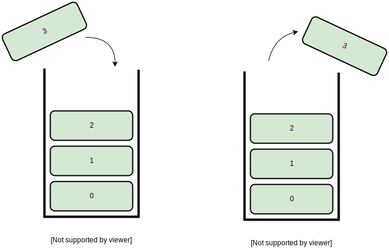

栈与队列
########

.. highlight:: c

数据结构的概念
==============

数据结构（Data Structure） 是数据的组织方式。程序中用到的数据都不是孤立的，而是有相互联系的，根据访问数据的需求不同，同样的数据可以有多种不同的组织方式。以前学过的复合类型也可以看作数据的组织方式，把同一类型的数据组织成数组，或者把描述同一对象的各成员组织成结构体。数据的组织方式包含了存储方式和访问方式这两层意思，二者是紧密联系的。例如，数组的各元素是一个挨一个存储的，并且每个元素的大小相同，因此数组可以提供按下标访问的方式，结构体的各成员也是一个挨一个存储的，但是每个成员的大小不同，所以只能用.运算符加成员名来访问，而不能按下标访问。

本章主要介绍栈和队列这两种数据结构以及它们的应用。从本章的应用实例可以看出，一个问题中数据的存储方式和访问方式就决定了解决问题可以采用什么样的算法，要设计一个算法就要同时设计相应的数据结构来支持这种算法。所以Pascal语言的设计者Niklaus Wirth提出：算法+数据结构=程序（详见 :ref:`[算法+数据结构=程序]` ）。

堆栈
====

*堆* 和 *栈* 是计算机程序中相当重要的两个概念。

虽然很多情况下，*堆栈* 这两个字常组合在一起使用，表示的却仅仅是 *栈* 的意思。虽然栈在很多使用场景上都是被分配在堆上的，但 *堆* 和 *栈* 还是需要区分开的。它们本来就不是同一个意思，*堆* 表示一类内存空间， *栈* 却是一种数据结构。

.. todo: C 语言本质 章节, 堆的介绍链接

栈是一系列数据的组合，类似于数组。但和数组不同的是，数组可以按索引进行访问，而栈只允许 ``push``, ``pop`` 两种行为:

-   ``push`` 向栈中压入一个元素
-   ``pop``  从栈中弹出一个元素

栈具有 *先进后出* 的性质，类似于一口井 -- 你可以向井里一层一层地扔东西，但是得把上层的东西掏出来才能拿到下层的东西:

在设计栈这类数据结构时，只需要满足三个要素就可以了:

1. 存储数据的空间
2. 指示当前层数的索引 (称作 *栈顶指针* )
3. push 与 pop 两个行为

其他的部分并不仅仅是栈的特征。我们用数组来存储 char 类型的数据，并设计一个栈::

    struct {
        int top;    // 栈的当前层数
        char *body; // 存储实际数据
    }

为了追求良好的编码风格，对于复杂的结构，定义其构造与析构函数: ``new``, ``delete`` 来初始化结构或释放内存。

另外，为了实际上应用的考虑，再添加一个 ``length`` 成员以限制栈的大小。

.. literalinclude:: _code/stack.reverse.print.c
    :language: c
    :linenos:
    :caption: 用栈实现逆序打印

``char_stack_t`` 的成员 ``body`` 是一个字符数组，栈的存储空间；而成员 ``top`` 则是 *栈顶指针*，在栈的任何一次操作中，它总是指向栈顶的当前元素，这被称作 *类不变性*。在前面的 :doc:`排序与查找` 中介绍了插入排序的 *循环不变性*，这里的 *类不变性* 与之类似:

1. 在 push 之前， top 指向栈顶元素
2. 在 pop 之前， top 指向栈顶元素
3. 在 push, pop 之后， top 指向新的栈顶元素

.. warning:: 在 ``pop`` 和 ``posh`` 操作中，总是要先检查 top 是否越界，否则会有发生 :ref:`段错误` 的危险。

除了利用上述的数组构成的栈之外，还可以利用递归函数来实现 "先进后出" 的逆序打印需求:

.. code-block:: c
    :linenos:
    :caption: 利用递归实现逆序打印

    #include <stdio.h>
    #define LEN 3

    char buf[LEN]={'a', 'b', 'c'};

    void print_backward(int pos)
    {
        if(pos == LEN)
        return;
        print_backward(pos+1);
        putchar(buf[pos]);
    }

    int main(void)
    {
        print_backward(0);
        putchar('\n');

        return 0;
    }

这是利用了函数的 *帧栈* 特性。所谓的 *帧* 就是指函数调用时所产生的作用域。在帧上，函数存储了本地变量的数据。在整个程序中，帧又是以栈的形式存储的。因此在递归调用中，也有 "先调用后结束" 的特性。

深度优先搜索
============

现在我们用堆栈解决一个有意思的问题，定义一个二维数组:

.. literalinclude:: _code/5x5.maze
    :caption: 迷宫设定

它表示一个迷宫，其中的 X 表示墙壁， O 表示可以走的路，只能横着走或竖着走，不能斜着走，要求编程序找出从左上角到右下角的路线。程序如下：

.. literalinclude:: _code/stack.maze.c
    :language: c
    :linenos:
    :caption: 用深度优先搜索解迷宫问题

这下，在栈 ``stack_t`` 中存储的元素是 ``point_t`` 类型的，存储了迷宫中一个位置的坐标。

让我们着重看看 ``walk`` 函数，了解迷宫中的每一步，程序是如何寻路的。

首先，我们走到了起点 (0, 0)，并将这一步压入路径栈。 然后就开始循环，进行了一系列判定：

1. 从路径栈中弹出一步（上一步）
2. 根据上一步的位置，首先判断是否已经到达终点，然后依次判定右，下，左，上是否可以移动。如果可以移动过去，则移动到目标位置。并将这一步存入栈中。
3. 当走到岔路时，将按照右、下、左、上的顺序随便走进一条路。
4. 当走到死路时，
